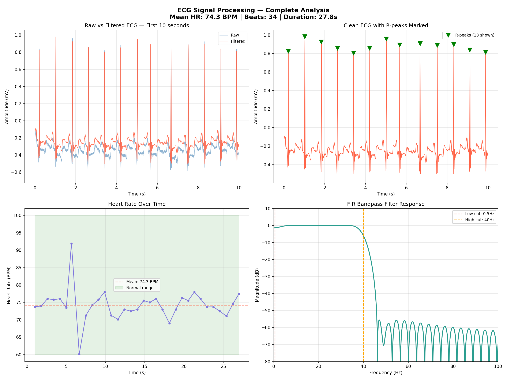
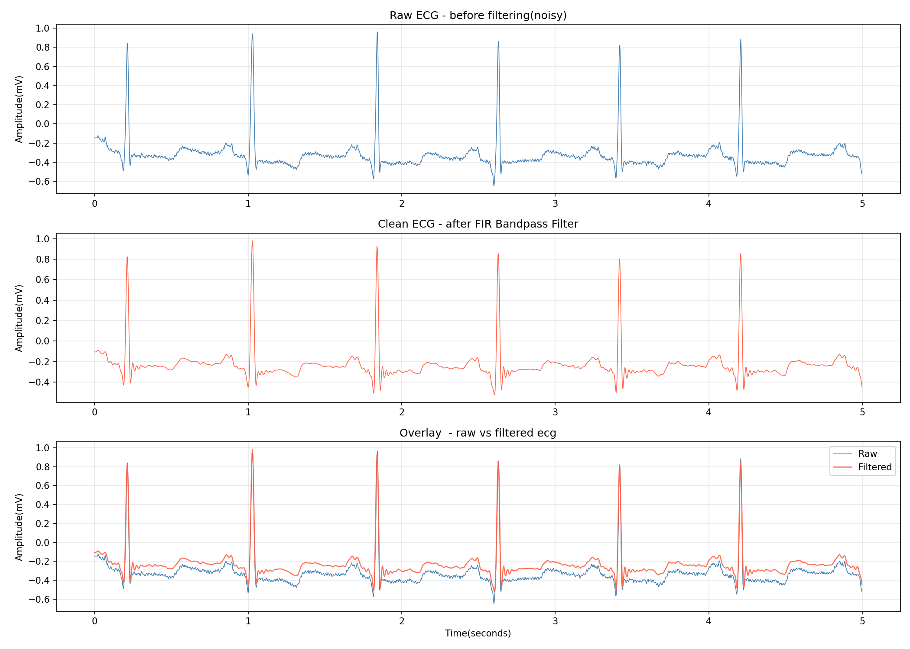

# 💓 ECG Signal Processing — Heart Rate Analysis

> FIR bandpass filter · R-peak detection · 
> Heart rate analysis · PhysioNet MIT-BIH database

---

## 📊 Results

### Complete ECG Analysis


### Raw vs Filtered Comparison


---

## ✨ What it does

- 📥 Downloads real ECG from PhysioNet MIT-BIH database
- 🔇 Applies FIR bandpass filter (0.5–40Hz)
- 💓 Detects R-peaks automatically
- 📈 Calculates heart rate statistics
- 🏥 Classifies as Normal/Bradycardia/Tachycardia

---

## 📋 Results from Analysis

| Metric | Value |
|--------|-------|
| Mean Heart Rate | 74.3 BPM ✅ Normal |
| Max Heart Rate | 91.9 BPM |
| Min Heart Rate | 60.2 BPM |
| HR Variability | 4.47 BPM |
| Noise Removed | 22.1% |
| False peaks removed | 1 |
| Total beats detected | 34 |

---

## 🧠 Key DSP Concepts

| Concept | Implementation |
|---------|---------------|
| FIR Bandpass Filter | firwin() — 0.5Hz to 40Hz, 101 taps |
| Zero-Phase Filtering | filtfilt() — no phase distortion |
| R-peak Detection | find_peaks() — height + distance constraints |
| RR Interval | Time between peaks → heart rate |
| Heart Rate Variability | Std deviation of beat-to-beat intervals |
| Baseline Wander | Removed by 0.5Hz highpass cutoff |

---

## 🏥 Clinical Relevance

| Frequency | Noise Type | Removed by |
|-----------|-----------|------------|
| Below 0.5Hz | Baseline wander — breathing, movement | Highpass at 0.5Hz |
| Above 40Hz | Muscle noise (EMG), electrical interference | Lowpass at 40Hz |
| 0.5–40Hz | Actual heartbeat signal | Kept — passband |

---

## 🛠️ Tech Stack

Python · NumPy · SciPy · Matplotlib · WFDB · PhysioNet

---

## ▶️ How to Run

```bash
pip install wfdb numpy scipy matplotlib
```

Open notebook in Google Colab and run all cells.
Data downloads automatically from PhysioNet.

---

## 📁 Project Structure
---

## 👩‍💻 Built by

**Aagya** — EEE/ECE Student @ Kathmandu University

[](https://github.com/aagya-dsp)
